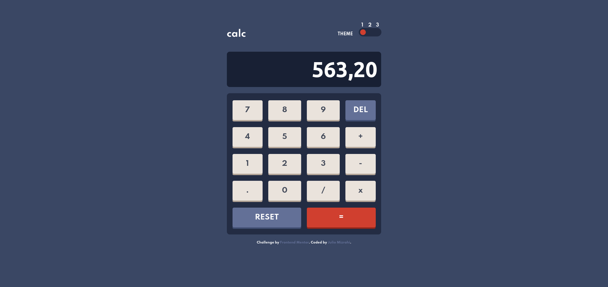
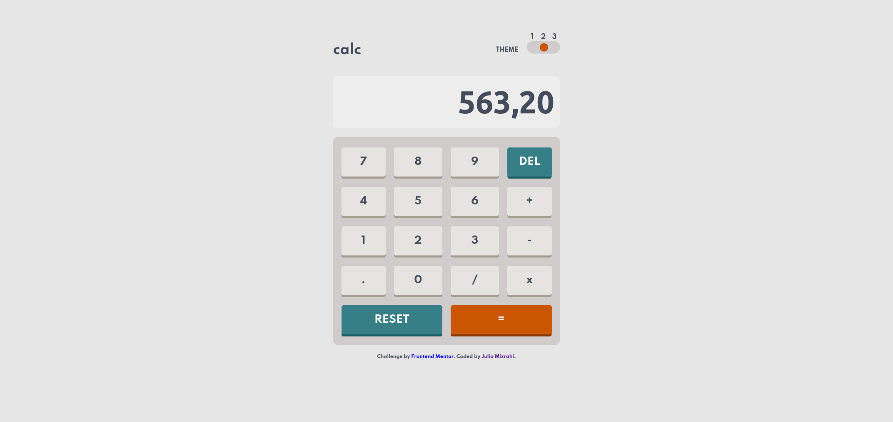
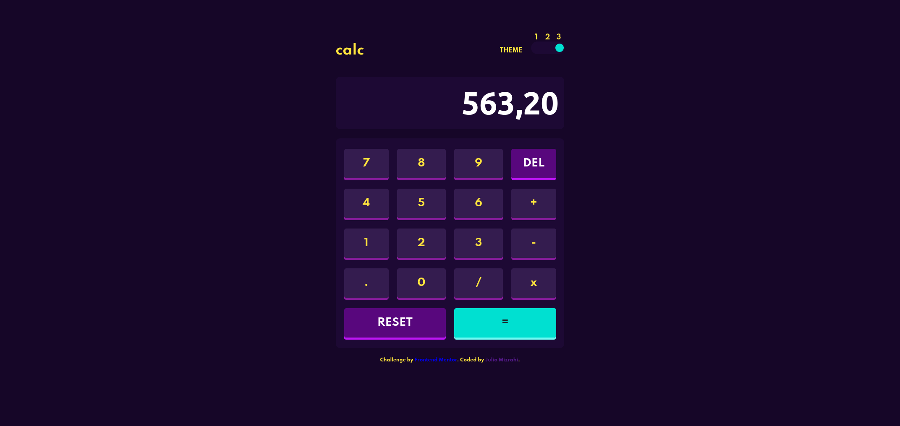
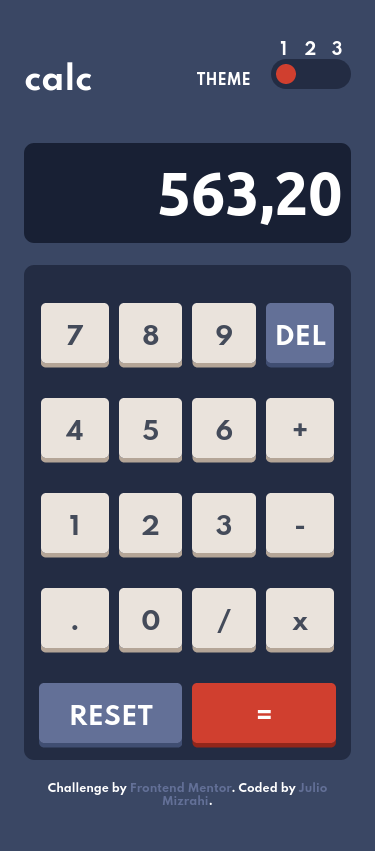
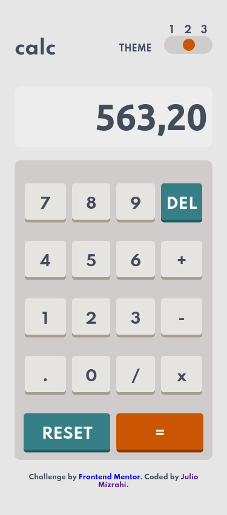
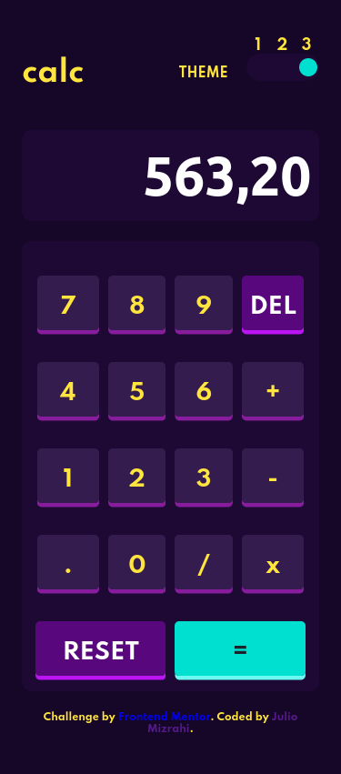

# Frontend Mentor - Calculator app solution

This is a solution to the [Calculator app challenge on Frontend Mentor](https://www.frontendmentor.io/challenges/calculator-app-9lteq5N29). Frontend Mentor challenges help you improve your coding skills by building realistic projects. 

## Table of contents

- [Overview](#overview)
  - [The challenge](#the-challenge)
  - [Screenshot](#screenshot)
  - [Links](#links)
- [My process](#my-process)
  - [Built with](#built-with)
- [Author](#author)

**Note: Delete this note and update the table of contents based on what sections you keep.**

## Overview

### The challenge

Users should be able to:

- See the size of the elements adjust based on their device's screen size
- Perform mathmatical operations like addition, subtraction, multiplication, and division
- Adjust the color theme based on their preference

### Screenshot
Desktop
- Theme 1

- Theme 2

- Theme 3

Mobile
- Theme 1

- Theme 2

- Theme 3

### Links
  https://marana12.github.io/Calculator-with-themes/

## My process

### Built with

- Semantic HTML5 markup
- CSS custom properties
- Flexbox
- JQuery
- CSS Grid
- Mobile-first workflow

## Author

- Frontend Mentor - [@marana12](https://www.frontendmentor.io/profile/marana12)

